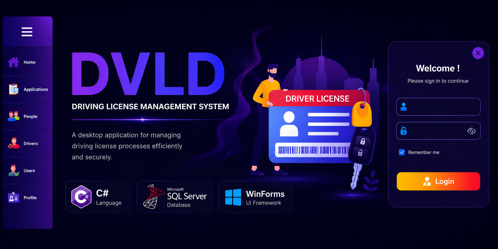
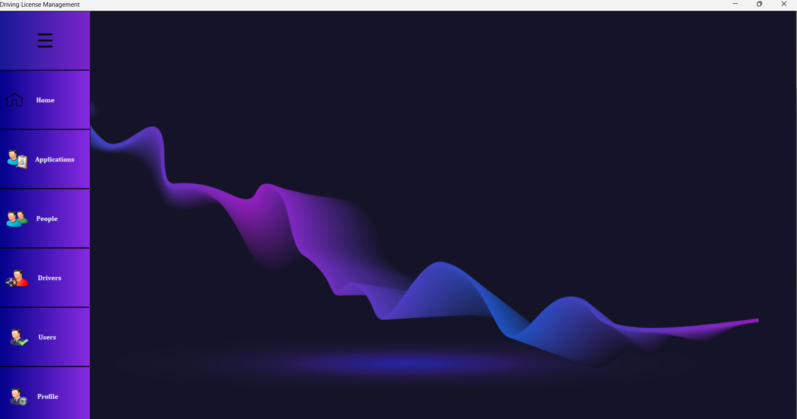
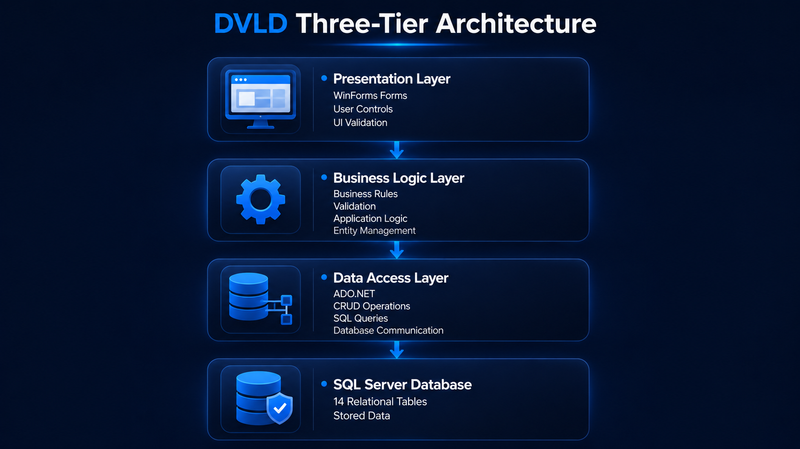

# 🚗 Driving & Vehicle License Department (DVLD)

<p align="center">
  
</p>

<div align="center">

### A Desktop Management System for Driving License Services


<br>


*A complete desktop solution that automates the workflow of a Driving & Vehicle License Department using **C#, WinForms, SQL Server, and ADO.NET**, following a clean **Three-Tier Architecture**.*

</div>

---

## 📑 Table of Contents

- [📖 Overview](#-overview)
- [🎯 Project Goals](#-project-goals)
- [✨ Core Features](#-core-features)
- [📸 Project Preview](#-project-preview)
- [🏗 System Architecture](#-system-architecture)
- [🛠 Technologies](#-technologies)
- [📂 Repository Structure](#-repository-structure)
- [🚀 Quick Start](#-quick-start)
- [📚 Documentation](#-documentation)
- [🎓 Learning Outcomes](#-learning-outcomes)
- [🔮 Future Improvements](#-future-improvements)
- [👨‍💻 Author](#-author)

---

# 📖 Overview

The **Driving & Vehicle License Department (DVLD)** is a Windows desktop application that digitizes and automates the complete driving license issuance process.

From applicant registration to license issuance and post-issuance services, the system manages the entire lifecycle while enforcing real-world business rules and validation.

This project was developed to strengthen software engineering skills by combining modern desktop development with layered architecture, database design, and clean coding practices.

---

# ✨ Core Features

The application provides a complete set of services required by a Driving & Vehicle License Department.

### Modules

- 🔐 User Authentication
- 👤 People Management
- 👥 User Management
- 🚗 Driver Management
- 📂 Local Driving License Applications
- 📝 Driving Test Management
- 🪪 License Services
- 🌍 International Driving Licenses
- 🚔 License Detention & Release
- ⚙ Application & Test Types Management

> 📖 **See the complete feature list:**  
> **[docs/features.md](docs/features.md)**

---

# 📸 Project Preview

Below are a few screenshots showcasing the application's interface and major workflows.

| Login | Dashboard |
|:------:|:---------:|
|  |  |

| Manage People | Manage Users |
|:-------------:|:------------:|
|  |  |

| Issue Driving License | International License |
|:---------------------:|:---------------------:|
|  |  |

> 📸 **View the complete application walkthrough:**  
> **[docs/screenshots.md](docs/screenshots.md)**

---

## 🏗 System Architecture

<p align="center">

</p>

The application follows a Three-Tier Architecture separating Presentation, Business Logic, and Data Access layers.

📖 **Learn more:** [Architecture Documentation](docs/architecture.md)

---

# 🛠 Technologies

| Technology | Purpose |
|------------|---------|
| **C#** | Primary Programming Language |
| **.NET Framework** | Desktop Application Framework |
| **WinForms** | User Interface |
| **ADO.NET** | Data Access |
| **SQL Server** | Relational Database |
| **Guna UI** | Modern UI Components |
| **Visual Studio 2022** | Development Environment |
| **Git & GitHub** | Version Control & Collaboration |

---

# 📂 Repository Structure

```text
Driving-License-Management-App/
│
├── assets/                    
├── Database/                 
├── docs/
│   │
│   ├── Architecture.md
│   ├── Database.md
│   ├── Features.md
│   ├── Installation.md
│   ├── Screenshots.md
│   │
│   ├── Diagrams/
│   │   ├── three-tier-architecture.png
│   │   ├── license-workflow.png
│   │   ├── database-erd.png
│   │   └── repository-structure.png
│   │
│   └── Screenshots/
│       ├── Login/
│       ├── Dashboard/
│       ├── Applications/
│       ├── People/
│       ├── Drivers/
│       ├── Users/
│       ├── Tests/
│       ├── LicenseServices/
│       ├── International/
│       └── Profile/
│
├── DVLD/
│   ├── DVLD.Presentation/
│   ├── DVLD.Business/
│   └── DVLD.DataAccess/
│
└── README.md
```

---

# 🚀 Quick Start

### 1. Clone the repository

```bash
git clone https://github.com/MONSEF441/Driving-License-Management-App.git
```

### 2. Restore the DVLD database

Restore the provided SQL Server database or execute the supplied SQL script.

### 3. Configure the connection string

Update the SQL Server connection string inside the project.

### 4. Build & Run

Open the solution using **Visual Studio 2022**, build the project, and run it.

> 📖 **Detailed installation guide:**  
> **[docs/Installation.md](docs/installation.md)**

---

# 📚 Documentation

The repository includes detailed documentation covering the application's architecture, implementation, and usage.

| 📄 Document | Description |
|-------------|-------------|
| 🏗 **[Architecture](docs/architecture.md)** | Three-Tier Architecture and project organization |
| ✨ **[Features](docs/features.md)** | Complete list of implemented modules |
| 💾 **[Database](docs/database.md)** | Database design and entity overview |
| 📸 **[Screenshots](docs/screenshots.md)** | Complete application walkthrough |
| 🚀 **[Installation](docs/installation.md)** | Installation and setup guide |

---

# 🎓 Learning Outcomes

Building this project allowed me to apply and strengthen practical knowledge in:

- Object-Oriented Programming (OOP)
- Three-Tier Architecture
- Windows Forms Development
- SQL Server Database Design
- ADO.NET Data Access
- Business Rule Implementation
- Layered Application Design
- Reusable User Controls
- UI Design for Desktop Applications
- Version Control with Git & GitHub

---

# 🔮 Future Improvements

Planned enhancements include:

- 📊 Dashboard Analytics
- 📄 PDF Report Generation
- 📝 Audit Logging
- 🔑 Enhanced Role-Based Permissions
- 🌐 REST API Integration
- ⚡ Entity Framework Core Version
- 🖥 WPF Migration

---

# 👨‍💻 Author

**Monssef Bougaidan**

Computer Science Student 

- 💻 C#
- 🖥 WinForms
- 🗄 SQL Server
- ⚙ ADO.NET
- 📚 Software Engineering

---

<div align="center">

### ⭐ If you found this project interesting, consider giving it a star!

</div>
