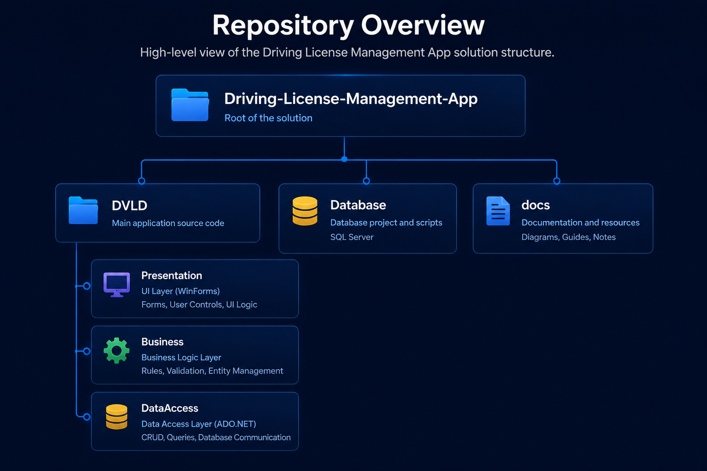

# 🏗 System Architecture

The Driving & Vehicle License Department (DVLD) application is designed using a **Three-Tier Architecture**, separating the application into independent layers. This architecture improves maintainability, scalability, and code organization by assigning each layer a specific responsibility.

---

# Architecture Overview

## Three-Tier Architecture

<p align="center">

</p>

The project follows a Three-Tier Architecture that separates the Presentation, Business Logic, and Data Access layers, promoting maintainability, separation of concerns, and code organization.


## Repository Structure

<p align="center">

</p>

The solution is organized into dedicated projects for presentation, business logic, and data access, with additional folders for documentation, database resources, and repository assets.


---

# Presentation Layer

The Presentation Layer is responsible for all user interactions. It contains the application's graphical user interface built with **Windows Forms** and modern UI components.

### Responsibilities

- Display application windows
- Handle user input
- Navigate between modules
- Perform basic input validation
- Display data returned from the Business Layer

### Components

- Forms
- User Controls
- Custom Controls
- Dialogs
- Context Menus

The Presentation Layer **does not communicate directly with the database**. All operations are delegated to the Business Layer.

---

# Business Logic Layer

The Business Layer contains the application's core business logic.

It acts as the bridge between the user interface and the database while enforcing the business rules required by the DVLD system.

### Responsibilities

- Validate user input
- Execute business rules
- Coordinate application workflow
- Manage entities
- Handle object creation and updates

Examples include:

- Prevent issuing a license before all required tests are passed.
- Prevent duplicate users.
- Verify application eligibility.
- Calculate application status.
- Validate license operations.

---

# Data Access Layer

The Data Access Layer is responsible for communicating with SQL Server using **ADO.NET**.

### Responsibilities

- Execute SQL queries
- Retrieve data
- Insert new records
- Update existing records
- Delete records
- Manage database connections

This layer isolates all database operations from the rest of the application.

---

# Database Layer

The database stores all persistent application data.

Main entities include:

- People
- Users
- Drivers
- Applications
- Licenses
- International Licenses
- Test Appointments
- Tests
- License Classes
- Countries
- Detained Licenses

Microsoft SQL Server is used as the relational database management system.

---

# Request Flow

A typical operation follows this sequence:

```
User
   │
   ▼
Presentation Layer
   │
   ▼
Business Layer
   │
   ▼
Data Access Layer
   │
   ▼
SQL Server
```

For example, when creating a new person:

```
User fills the form
        │
        ▼
Presentation validates required fields
        │
        ▼
Business validates National Number uniqueness
        │
        ▼
Data Access executes INSERT query
        │
        ▼
SQL Server stores the record
```

---

# Benefits of Three-Tier Architecture

- Separation of Concerns
- Easier Maintenance
- Improved Code Reusability
- Better Testability
- Easier Future Expansion
- Simplified Debugging
- Clear Project Organization

---

# Project Layers

```
DVLD/

Presentation Layer
│
├── Forms
├── User Controls
├── Custom Controls
└── Resources

Business Layer
│
├── Business Classes
├── Validation
└── Business Rules

Data Access Layer
│
├── Database Classes
├── SQL Operations
└── Connection Management

Database
│
└── SQL Server
```

---

# Design Principles

The project follows several software engineering principles:

- Layered Architecture
- Separation of Concerns
- Object-Oriented Programming (OOP)
- Reusable Components
- Encapsulation
- Code Modularity
- Single Responsibility Principle (where applicable)

---

# Future Improvements

Potential architectural enhancements include:

- Repository Pattern
- Dependency Injection
- Entity Framework Core
- Logging Framework
- Configuration Management
- REST API Backend
- WPF or .NET MAUI Frontend
