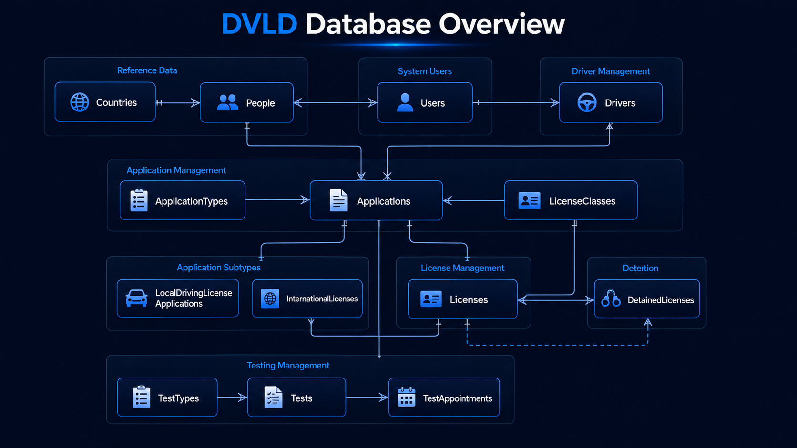

# 💾 Database Design

The DVLD database consists of 14 relational tables that model the complete driving license lifecycle, including applicants, drivers, licenses, applications, tests, and supporting entities.

---

# Database Overview

The system consists of **14 relational tables** that manage applicants, users, licenses, tests, and applications.

| Table | Purpose |
|--------|---------|
| Countries | Stores country information |
| People | Stores personal information |
| Users | Stores system users |
| Drivers | Stores licensed drivers |
| Applications | Stores all applications |
| ApplicationTypes | Defines application categories |
| LicenseClasses | Stores available license classes |
| LocalDrivingLicenseApplications | Local driving license applications |
| TestTypes | Defines available test types |
| TestAppointments | Test scheduling |
| Tests | Stores completed test results |
| Licenses | Issued driving licenses |
| InternationalLicenses | International driving licenses |
| DetainedLicenses | Detained license records |

---

# Entity Relationships

The database follows a relational model where entities are connected using foreign keys.

Examples include:

- One Country can have many People.
- One Person can own one User account.
- One Person can become one Driver.
- One Driver can own multiple Licenses.
- One Application belongs to one Applicant.
- One Application can have multiple Test Appointments.
- One License can be detained and later released.

---

# Core Modules

## People

Stores personal information for applicants and drivers.

Examples:

- National Number
- Full Name
- Date of Birth
- Address
- Country

---

## Users

Stores authentication information for system users.

Examples:

- Username
- Password
- Active Status
- Linked Person

---

## Applications

Represents every application submitted to the department.

Examples:

- New Local License
- License Renewal
- Lost License Replacement
- Damaged License Replacement
- International License

---

## Tests

The testing subsystem consists of three entities:

- Test Types
- Test Appointments
- Tests

Together they manage the scheduling and results of:

- Vision Test
- Written Test
- Street Test

---

## Licenses

Stores all issued driving licenses.

Information includes:

- License Number
- License Class
- Issue Date
- Expiration Date
- Driver
- Active Status

---

## International Licenses

Stores international driving licenses issued to eligible drivers.

---

## Detained Licenses

Stores detention records including:

- Detain Date
- Fine Fees
- Release Date
- Released By User

---

# Database Integrity

The database maintains consistency through:

- Primary Keys
- Foreign Keys
- Identity Columns
- Relational Constraints

Business rules are enforced by the application through the Business Layer.

---

# Database Diagram

A complete Entity Relationship Diagram (ERD) is available below.

---

# Summary

The database structure is designed to support the entire driving license lifecycle, from applicant registration and testing to license issuance, renewal, replacement, detention, and international licensing.
